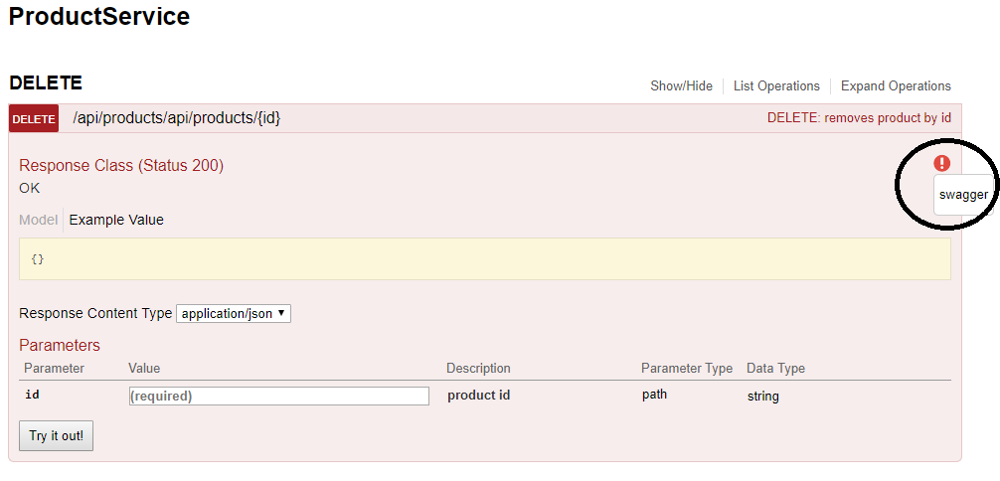
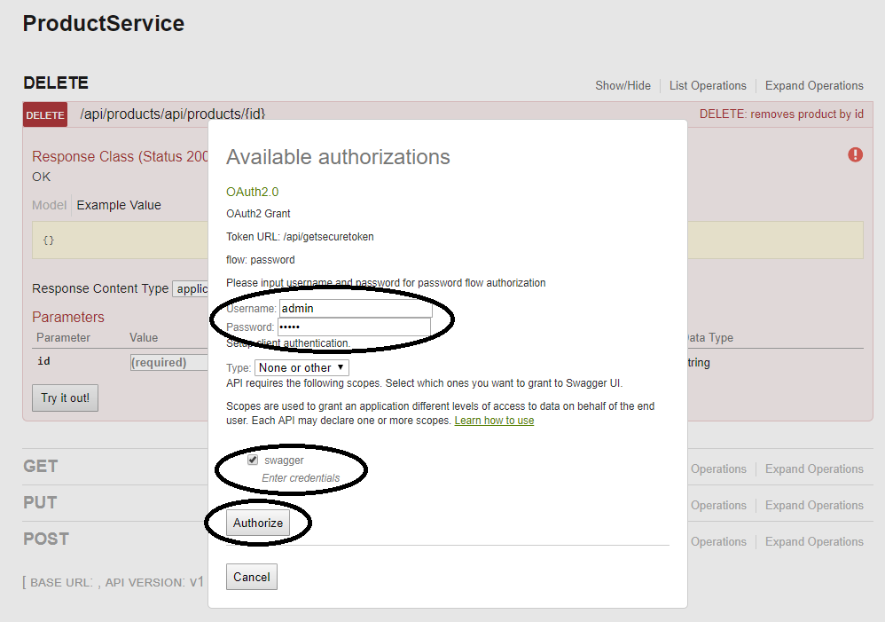
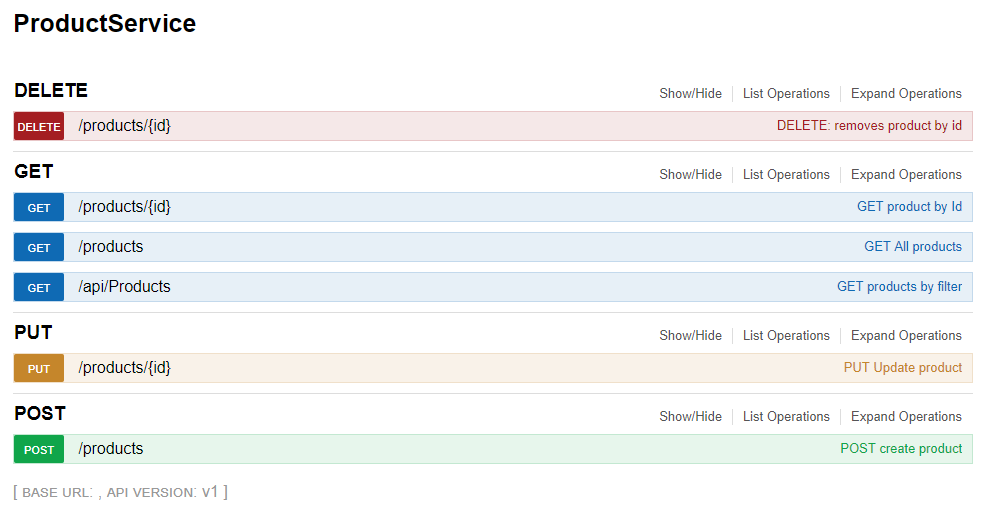
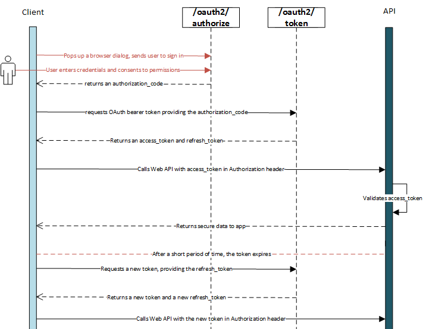

# Product Service Setup

## Required tools
- Visual Studio (2017)
- Redis Server (`/tools/redis-server.exe`)


## Design Scenario
Implement a RESTful web service that performs CRUD operations (Create, Read, Update, and Delete)
for a Product entity.

```
public class Product
{
  public string Id { get; set; }
  public string Description { get; set; }
  public string Model { get; set; }
  public string Brand { get; set; }
}
```
The following routes are to be implemented:
```
GET products
GET products/{id}
POST products
PUT products/{id}
DELETE products/{id}
```

The following is expected:
1) Use C# and the Web Api 2 Framework
2) Implement some form of automated testing
3) Use some form of in-memory persistence

For extension:
1) Apply some form of authentication and/or authorisation (with details as to what
and why)
2) Add filtering to the GET products route (e.g. filter by Description/Model/Brand)
3) Create a light weight UI for querying the api

## How to run
The product service solution was built with Visual Studio 2017, utilising C# .Net Web Api 2, redis in-memory storage and OAuth2 Authentication. I have also utilised the Moq nuget package for unit testing purposes.
There is a swagger ui client that will allow you to test this restful service - please note, the Delete endpoint will require OAuth authentication - refer to instructions below for running with swagger.

To Run the application, you will need to:
1. Launch redis-server.exe found in the root `tools` folder - double click to run and leave running whilst using the service.
2. From within Visual Studio, `build` the solution (including restore of any nuget packages), then `run` the api (IIS Express) - setting `ProductService` as the startup project if required.

This will take you to the default swagger landing page (http://localhost:14156/swagger/ui/index), presenting all of the api endpoints with functionality to try each out.

The product service `Delete` endpoint has been locked down to only allow admin access, therefore to test this piece of functionality, Swagger has a password flow built in that allows you to grant OAuth2 authorization by entering the required admin username/password and selecting the swagger scope to allow test authorization.

1. Click on the red exclamation mark on swagger to bring up the password auth form:


2. Enter Admin username ("admin") and password ("password") and check the `swagger` checkbox, then click the Authorize button:


Note: If you do not authorise yourself when calling the delete endpoint, then you will get a 401 error:
```
{
  "message": "Authorization has been denied for this request."
}
```

## Solution Overview



VS Solution Overview:
- `ProductService` - Web Api serving product endpoints
- `ProductService.Tests` - Unit tests for ProductService

### Swagger UI
Swagger is being used as a UI to demonstrate the Product Service api. This has been set as the landing page of the solution - so running this from Visual Studio will take you to: http://localhost:14156/swagger/ui/index

### In-Memory persistance
Redis server has been used, utilising the popular StackServer.Redis nuget package. This affords the api to persist product data in-memory.
In order to run this solution, the redis-server.exe needs to be started and running first; this is located within the `/tools` directory in the root of the solution.

### Security

OAuth2 is the industry-standard protocol for authorization.



OAuth2 has been implemented with controller authorization attributes plugged into the product service delete endpoint.
Note: For simplicity sake of this challenge, there are hard-coded user credentials/logic in the authorisation process as a proof of concept. Traditionally you would have a seperate service not tied to the resource service that would be responsible for authenticating/authorising and issuing the token. The important idea being illustrated here is that credintials are passed in, a user is authenticated and a bearer token is returned to the client. All subsequent client communication utilises this token to access locked down resources (i.e. delete endpoint) until it expires - in which case the authentication/token verification process begins again.

#### Test Users
- Username: `admin` / Password: `password` (Has access to the delete endpoint)
- Username: `user` / Password: `password` (Does not have access to the delete endpoint)

### Unit testing
Unit tests are created using the Microsoft Unit Test Tools. These can be run from within Visual Studio utiilising the test explorer.
There is test coverage surrounding the in-memory persistance CRUD operations. This utilises the Moq nuget package to substitute in a mock of the Redis Server Client.

### Logging
A global Exception Filter is being used, which onException will return a generic response with a status code 500.
A global Exception Logger is in place which will log the exception using NLog, configured to log to a text file. The log file location is configured in the `web.config` to be in the folder `APILog` within the root `ProductService` folder.

## Requests / Responses

### POST products
Request Url: http://localhost:14156/products

Request payload:
```
{
  "id": "string",
  "description": "string",
  "model": "string",
  "brand": "string"
}
```
```
Response:
{
  "id": "1",
  "description": "string",
  "model": "string",
  "brand": "string"
}
```

### PUT product (products/{id})
Request Url: http://localhost:14156/products/1

Request payload:
```
{
  "id": "1",
  "description": "string",
  "model": "string",
  "brand": "string"
}
```
```
Response:
{
  "id": "1",
  "description": "string",
  "model": "string",
  "brand": "string"
}
```

### GET products
Request Url: http://localhost:14156/products

Request payload:
```
{}
```
```
Response:
[
  {
    "id": "1",
    "description": "string",
    "model": "string",
    "brand": "string"
  }
]
```

### GET product (products/{id})
Request Url: http://localhost:14156/products/1

Request payload:
```
{}
```
```
Response:
[
  {
    "id": "1",
    "description": "string",
    "model": "string",
    "brand": "string"
  }
]
```

### GET product by filter (products/{q.model}/{q.brand}/{q.description})
Request Url: http://localhost:14156/api/Products?q.model=string&q.brand=string&q.description=string

```
FromUri parameters:
- Model: optional / case insensitive / equals match
- Description: optional / case insensitive / contains match
- Brand: optional / case insensitive / equals match
```

Request payload:
```
{}
```
```
Response:
[
  {
    "id": "1",
    "description": "string",
    "model": "string",
    "brand": "string"
  }
]
```

## Caveats (Could have but didn't...)

- Limited validations in place within the api - for a simple product CRUD use-case, there was no need, however typically you would safe-guard your api (Garbage-in/Garbage-out principle) to validate user input.
- As mentioned, the solution is using hard-coded user credentials/authorization logic - this would never happen in production and is merely in for demo purposes.
- The api lacks finishing touches such as paging, sorting, field selection, filter flexibility, etc - which would typically be included (perhaps via OData). It also lacks versioning, however as this was a simple implementation, it felt like overkill to add this in.
- No unit testing on the api controllers - I could have added in more testing, but as the controller actions are particularly lightweight wrappers to the repositorys (which are being tested), I didnt see much point.
- Split out in-memory persistance logic - typically I wouldn't package the "data layer" in the same project as the api, however as this was a simple in-memory repo, I felt it may be overkill to split everything up into a traditional project structure. Typically you would do this for reusability and separation of concern practices.
